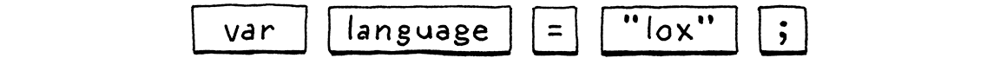

# Scanning
> Take big bites. Anything worth doing is worth overdoing. - Robert A. Heinlein, Time Enough for Love

Scanning is first step in any compiler or interpreter. The scanner takes in raw source code as  series of characters
and groups it into a series of chunks we call **tokens**.

## Lexemes and Tokens

Let's consider this line of Lox code:
`var language = "log"`

`var` is the keyword for declaring a variable. That three-character sequence "v-a-r" means something.
That's what lexical analysis is about. Our job is to scan through the list of characters and group them
together into the smallest sequences that still represent something.
Each of these blobs of characters is called a **lexeme** , check the image below.

The lexemes are only the raw substrings of the source code.
We bundle them with other useful data we get a **token** which includes
useful data like:

### Token Type

